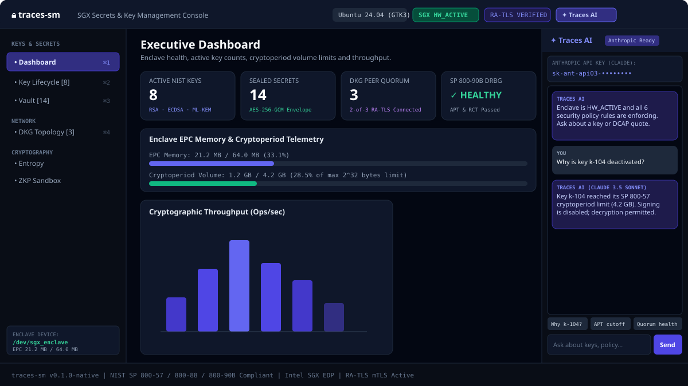
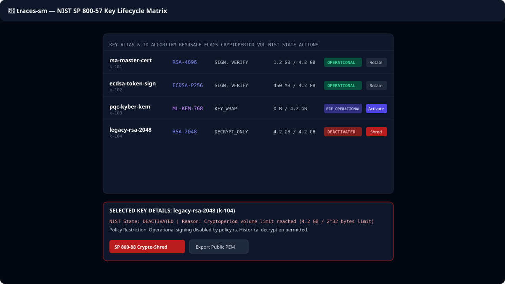

# `traces-sm` — 100% Rust-Native Multi-OS SGX Secrets & Key Management Framework

[](https://github.com/arjun-traces/traces-sm/actions/workflows/ci.yml)
[](https://arjun-traces.github.io/traces-sm/)
[](LICENSE)
[](docs/STANDARDS_MAPPING.md)

> `traces-sm` is an open-source key and secret management framework that runs its cryptographic operations inside an Intel SGX enclave, written entirely in Rust on Fortanix EDP.

---

## 🖥️ Management Console Screens

### Executive Dashboard & Telemetry


### NIST SP 800-57 Key Lifecycle Matrix & State Machine


---

## 🛑 What It Is / What It Is Not

### What It Is:
- A **100% Rust-Native 5-crate workspace** (`enclave`, `host`, `gui`, `cli`, `desktop`) providing hardware memory encryption for keys and secrets.
- An **NIST SP 800-57 aligned lifecycle manager** featuring 4-phase state transitions, volume cryptoperiod meters, and FIPS 140-3 in-memory zeroization (`zeroize`).
- A multi-interface platform supporting WebAssembly browser dashboards, native desktop consoles (Ubuntu, Windows, macOS), and multi-OS CLI tools.

### What It Is Not:
- ❌ **Not NIST CMVP Certified**: `traces-sm` implements FIPS design patterns, but holds **no official NIST CMVP certificate number**.
- ❌ **Not Externally Audited**: This codebase has not undergone a third-party cryptographic security audit.
- ❌ **Not a Cloud SaaS Replacement**: It is a self-hosted framework for confidential computing infrastructure.

---

## 🔒 Security & Maturity Disclaimers

> **Security Notice**: `traces-sm` is research-grade software. While cryptographic primitives execute within an Intel SGX Enclave Page Cache (EPC) using `zeroize` memory scrubbing, experimental features (such as PQC stubs) are strictly gated with `NotImplemented` errors until formal integration. Use in production at your own risk following thorough auditing.

---

## 🏛️ 100% Rust-Native 5-Crate Workspace Architecture

```
┌──────────────────────────────────────────────────────────────────────────────────────────────────┐
│                               100% RUST-NATIVE `traces-sm` WORKSPACE                             │
│                                                                                                  │
│  User & Client Interfaces                                                                        │
│  ┌──────────────────────────┐  ┌──────────────────────────────┐  ┌─────────────────────────────┐  │
│  │ Rust WebAssembly Web GUI │  │ Rust Native Desktop App      │  │ Rust Native CLI Tool        │  │
│  │ (`gui/` -> Yew 0.21 WASM)│  │ (`desktop/` -> Ubuntu, Win,  │  │ (`cli/` -> Multi-OS Distros)│  │
│  │                          │  │  macOS via `eframe`/`egui`)  │  │                             │  │
│  └────────────┬─────────────┘  └──────────────┬───────────────┘  └──────────────┬──────────────┘  │
│               │                               │                                 │                │
├───────────────┼───────────────────────────────┼─────────────────────────────────┼────────────────┤
│ Host Layer (Untrusted Proxy)                  │                                 │                │
│               └───────────────────────────────┼─────────────────────────────────┘                │
│                                               │ REST / mTLS                                      │
│  ┌────────────────────────────────────────────▼───────────────────────────────────────────────┐  │
│  │ Rust Native Host Proxy (`host/` -> Axum 0.7 + Tokio + Rusqlite)                            │  │
│  │ • Serves WebAssembly Web GUI static assets on port 8080                                    │  │
│  │ • Manages SQLite metadata DB, audit logs, and DKG topology                                  │  │
│  └────────────────────────────────────────────┬───────────────────────────────────────────────┘  │
├───────────────────────────────────────────────┼──────────────────────────────────────────────────┤
│ SGX Enclave Layer (Trusted EPC)               │ Plain TCP / mTLS (Port 8443)                     │
│  ┌────────────────────────────────────────────▼───────────────────────────────────────────────┐  │
│  │ Rust SGX Enclave (`enclave/` -> Fortanix EDP `x86_64-fortanix-unknown-sgx`)               │  │
│  │ • In-Enclave Key Generation Catalog Engine (`keygen.rs`)                                   │  │
│  │ • Mandatory NIST Security Policy Engine (`policy.rs`)                                      │  │
│  │ • NIST SP 800-90A/B/C Entropy & DRBG Engine (`drbg.rs`)                                    │  │
│  │ • NIST SP 800-57 Key Lifecycle State Machine (`nist.rs`)                                   │  │
│  │ • Classic (RSA/ECDSA/Ed25519) + PQC (ML-KEM/ML-DSA) Engines (`keygen.rs`, `pqc.rs`)        │  │
│  │ • Threshold DKG (Shamir SSS / Pedersen VSS) & PHE (`dkg.rs`, `paillier.rs`)               │  │
│  │ • Zero-Knowledge Proofs (Schnorr PoK & Bulletproof Range Proofs) (`zkp/`)                  │  │
│  │ • FIPS 140-3 Zeroization & NIST SP 800-88 Crypto-Shredding (`store.rs`)                    │  │
│  └────────────────────────────────────────────────────────────────────────────────────────────┘  │
└──────────────────────────────────────────────────────────────────────────────────────────────────┘
```

---

## 🔑 Key Generation & Algorithm Catalog

| Algorithm Family | Supported Key Generation Schemes | Status | Standard / Spec |
|---|---|---|---|
| **RSA** | RSA-2048, RSA-4096 | ✅ Implemented | FIPS 186-5 / OAEP |
| **ECDSA** | P-256, P-384, P-521, Secp256k1 | ✅ Implemented | FIPS 186-5 / SECG |
| **Ed25519 / X25519** | Ed25519, X25519 | ✅ Implemented | RFC 8032 / RFC 7748 |
| **Post-Quantum (PQC)**| ML-KEM-768/1024, ML-DSA-3/5, SLH-DSA | ⚠️ Experimental | FIPS 203 / 204 / 205 |
| **Symmetric & Key Wrap**| AES-128/256-GCM, AES-KW | ✅ Implemented | SP 800-38D / SP 800-38F |
| **Threshold DKG** | Shamir SSS, Pedersen VSS, FROST | ⚠️ Partial | RFC 9591 / DKLs23 |
| **SSL/TLS & PKI** | X.509 Cert Bundles, OpenSSH KeyPairs | ✅ Implemented | RFC 5280 / OpenSSH |

---

## ⚡ 60-Second Quickstart

```bash
# 1. Clone the repository
git clone https://github.com/arjun-traces/traces-sm.git
cd traces-sm

# 2. Launch Cross-Platform Desktop App (Ubuntu / Windows / macOS)
cd desktop && cargo run --release

# 3. Or Build & Serve WebAssembly GUI + Axum Host
cd ../gui && trunk build --release
cd ../host && cargo run --release
```

---

## 📚 Documentation Directory (`docs/`)

- [**Status & Maturity**](docs/STATUS.md)
- [**Standards Implementation Mapping**](docs/STANDARDS_MAPPING.md)
- [**Technical Specification**](docs/SPECIFICATION.md)
- [**Architecture Walkthrough**](docs/ARCHITECTURE.md)
- [**CLI Reference**](docs/CLI.md)
- [**Product Specification**](docs/PRODUCT_SPECIFICATION.md)
- [**Conformance Report**](docs/CONFORMANCE_REPORT.md)
- [**Page-by-Page UI/UX Design**](docs/PAGE_BY_PAGE_DESIGN.md)
- [**Windows Build Guide**](docs/WINDOWS_BUILD_GUIDE.md)
